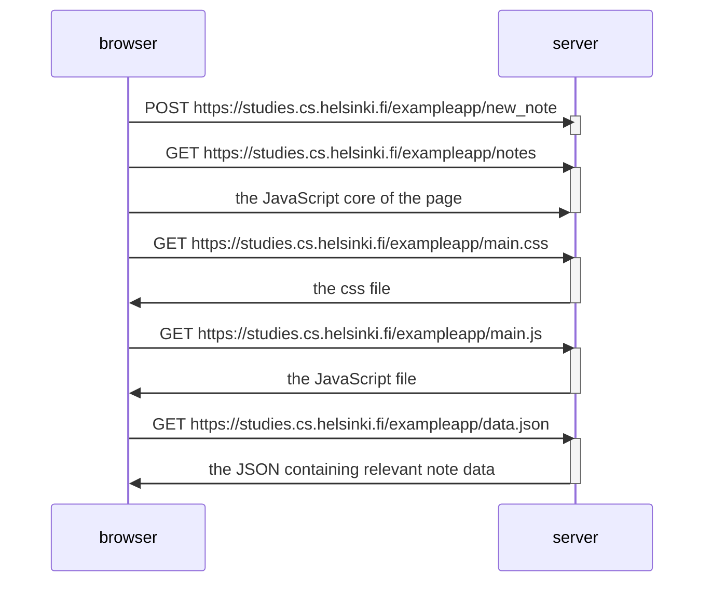

```mermaid
  sequenceDiagram
    participant browser
    participant server

    browser->>server: POST https://studies.cs.helsinki.fi/exampleapp/new_note 
    activate server
    deactivate server

    browser->>server: GET https://studies.cs.helsinki.fi/exampleapp/notes
    activate server
    browser->>server: the JavaScript core of the page
    deactivate server

    browser->>server: GET https://studies.cs.helsinki.fi/exampleapp/main.css 
    activate server
    server->>browser: the css file
    deactivate server

    browser->>server: GET https://studies.cs.helsinki.fi/exampleapp/main.js 
    activate server
    server->>browser: the JavaScript file
    deactivate server

    browser->>server: GET https://studies.cs.helsinki.fi/exampleapp/data.json
    activate server
    server->>browser: the JSON containing relevant note data
    deactivate server
```
